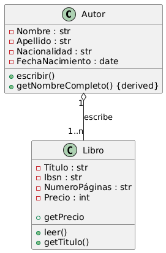
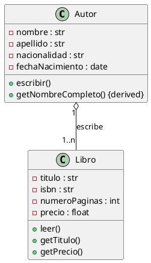

## Ejercicio - Autor y Libro

## Análisis del Problema

### Identificación de Clases

Del análisis del problema, identificamos las siguientes clases:

1.  **Autor** 
    * Representa a la persona que escribe uno o varios libros.
    * **Atributos**: `nombre` (str), `apellido` (str), `nacionalidad` (str), `fechaNacimiento` (date).
    * **Métodos**: `escribir()`, `getNombreCompleto()` (derivada).

2.  **Libro** 
    * Representa una obra escrita por un autor.
    * **Atributos**: `titulo` (str), `isbn` (str), `numeroPaginas` (int), `precio` (float/int).
    * **Métodos**: `leer()`, `getTitulo()`, `getPrecio()`.

## Análisis de Relaciones

### 1. Agregación (Autor – Libro)
* **Nombre de la relación**: "escribe"
* **Tipo**: **Agregación** (rombo blanco en la clase **Autor**).
* **Cardinalidad**:
    * **Autor**: **1** (Cada libro está asociado a un único autor).
    * **Libro**: **1..\*** (Un autor puede escribir uno o varios libros).
* **Justificación**: Esta agregación indica que un **Autor** "tiene" o "escribe" **Libros**. Los libros son conceptualmente parte de la obra total del autor, pero un libro puede existir independientemente (no morir) si eliminamos al Autor del sistema (es decir, el registro del libro persiste).

## Diagrama de Clases

## Código PlantUML

## Implementación en Kotlin

## Conceptos Clave de UML Aplicados

