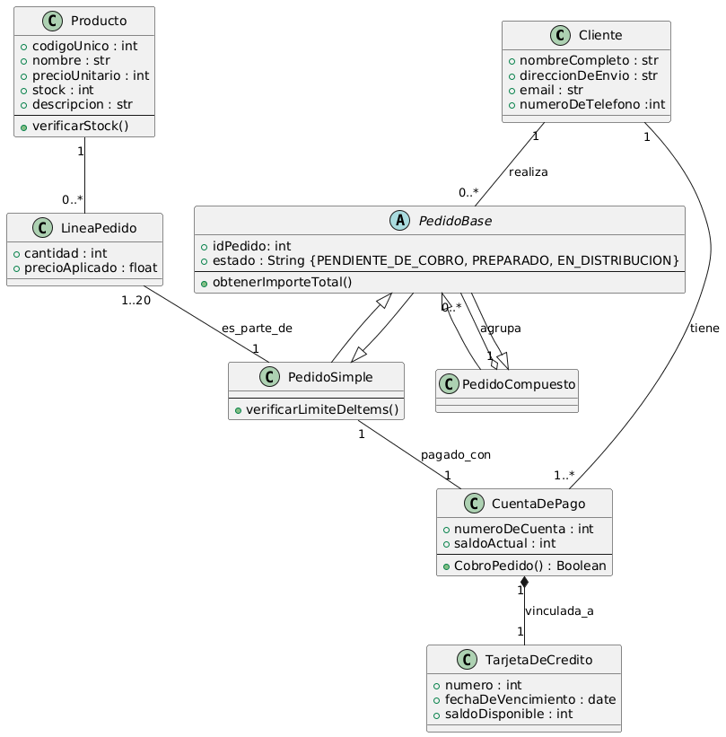

# Gestion de pedidos

## Análisis del Problema

En este ejercicio se modela un sistema sencillo de compras en el que un cliente realiza pedidos utilizando cuentas con saldo disponible y tarjetas de crédito asociadas.

### Identificación de Clases

**Cliente**  
Representa a la persona que realiza pedidos en el sistema.  
- `nombreCompleto: str`  
- `direccionEnvio: str`  
- `numeroTelefono: str`  
- `email: str`

**Cuenta**  
Gestiona el saldo disponible para pedidos.  
- `+aumentarSaldo()`

**TarjetaCredito**  
Vinculada a una cuenta.  
- `saldo: int`

**Pedido**  
Realizado por un cliente.

**Producto**  
Controla stock disponible.  
- `stock: int`

**PedidoSimple**  
Pedido con límite de productos.  
- `numeroMaximoProductos: int`

## Relaciones

**Relación Cliente - Cuenta**  
Un cliente tiene una o varias cuentas (cardinalidad 1 → 1..n). Esto permite que cada cliente gestione múltiples cuentas para sus pagos.

**Relación Cliente - Pedido**  
Un cliente realiza uno o varios pedidos (cardinalidad 1 → 1..n). Cada pedido está asociado a un único cliente.

**Relación Cuenta - TarjetaCredito**  
Cada cuenta está vinculada a una única tarjeta de crédito (cardinalidad 1 --* 1 Composicion). Esto establece una relación uno a uno entre cuenta y tarjeta.

## Diagrama de Clases



## Diagrama PlantUML

```
@startuml

class Cliente {
    + nombreCompleto : str
    + direccionDeEnvio : str
    + email : str
    + numeroDeTelefono :int
}

class CuentaDePago {
    + numeroDeCuenta : int
    + saldoActual : int
    --
    + CobroPedido() : Boolean
}

class TarjetaDeCredito {
    + numero : int
    + fechaDeVencimiento : date
    + saldoDisponible : int
}

class Producto {
    + codigoUnico : int
    + nombre : str
    + precioUnitario : int
    + stock : int
    + descripcion : str
    --
    + verificarStock()
}

abstract class PedidoBase {
    + idPedido: int
    + estado : String {PENDIENTE_DE_COBRO, PREPARADO, EN_DISTRIBUCION}
    --
    + obtenerImporteTotal()
}


class PedidoSimple extends PedidoBase {
    --
    + verificarLimiteDeItems()
}

class PedidoCompuesto extends PedidoBase {
}


class LineaPedido {
    + cantidad : int
    + precioAplicado : float
}

PedidoSimple <|-- PedidoBase
PedidoCompuesto <|-- PedidoBase
PedidoCompuesto "1" o-- "0..*" PedidoBase : agrupa
Producto "1" -- "0..*" LineaPedido
LineaPedido "1..20" -- "1" PedidoSimple : es_parte_de
Cliente "1" -- "1..*" CuentaDePago : tiene
CuentaDePago "1" *-- "1" TarjetaDeCredito : vinculada_a
Cliente "1" -- "0..*" PedidoBase : realiza
PedidoSimple "1" -- "1" CuentaDePago : pagado_con

@enduml
```

## Código en Kotlin

´´´

    import java.time.localDate

    class Cliente(val nombreCompleto: String, val direccionDeEnvio: String, val email: String, val numeroTelefono: Int){

    }

    class CuentaDePago(val numeroDeCuenta: Int, val saldoActual: Int){

        fun CobroPedido(){

        }
    }

    class TarjetaDeCredito(val nuemro: Int, val fechaDeVencimiento: localDate, val saldoDisponible: Int){

    }

    class Producto(val codigoUnico: Int, val nombre: String, val precioUnitario: Int, val stock: Int, val descripcion: String){

        fun verificarStock(){

        }
    }

    open class PedidoBase(val idPedido: Int, val estado: String){

        fun obtenerIMporteTotal(){

        }
    }   

    class pedidoSimple() : PedidoBase(idPedido, estado){

        fun verificarLimiteDeItems(){

        }
    }

    class PedidoCompuesto() : PedidoBase(idPedido, estado){

    }

    class LineaPedido(val cantidad: Int, val precioAplicado: Float){

    }
´´´
